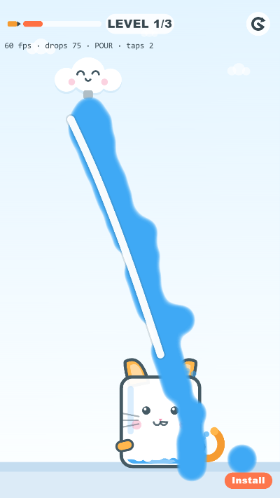
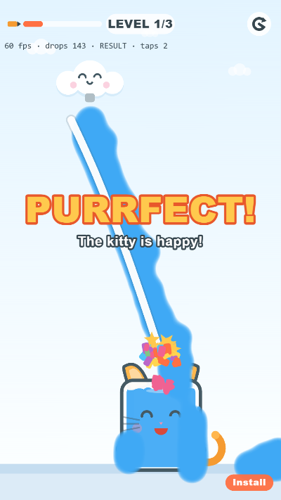
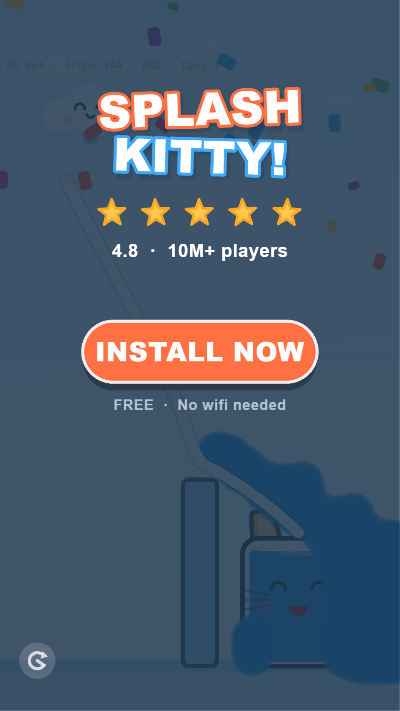

# Splash Kitty! — playable ad (портфолио)

**Playable ad unit** выдуманной казуальной игры: нарисуй пальцем линию — и капли дождя
по ней стекают в кота-стакана. Один самодостаточный `index.html`, как настоящий
 рекламный unit для Google Ads / AppLovin / MRAID-среды.

> **Играть онлайн:** [kerarty.github.io/splash-kitty-playable-ad](https://kerarty.github.io/splash-kitty-playable-ad/) · [демо-страница](https://kerarty.github.io/splash-kitty-playable-ad/demo.html)

| Teaser | Геймплей | Победа | End card |
| --- | --- | --- | --- |
|  |  |  |  |

## Запуск

```bash
npm install
npm run build     # → dist/index.html (single file) + dist/demo.html
npm run serve     # → http://localhost:8137 (demo: /demo.html)
```

- **`dist/index.html`** — сам ad unit: открой в браузере или на телефоне, работает без сервера.
- **`dist/demo.html`** — витрина для портфолио: юнит в рамке телефона + бейджи.
- **`dist/splash-kitty-playable.zip`** — артефакт для «студии»: только index.html.

## Метрики

| Метрика | Значение | Требование индустрии |
| --- | --- | --- |
| Размер unit | **683 КБ raw / 205 КБ gzip / 209 КБ zip** | ≤ 5 МБ (Google Ads) |
| Сетевых запросов после загрузки | **0** | 0 обязательны |
| Зависимостей в рантайме | 0 (всё забандлено) | — |
| Сессия | ~30 сек, 3 уровня | 15–60 сек |
| Первый интерактивный момент | < 1 сек (туториал-рука) | ≤ 3 сек |
| FPS | 60 (game loop с fixed timestep) | 60 |

Автотест-прогон (`?debug=1` + `window.__splashKitty`): три уровня проходятся
подряд — результаты каждого уровня логируются в `debug.result`.

## Как это устроено

```
src/
  main.js      state machine (TEASER→DRAW→POUR→SETTLE→RESULT→END), game loop, ввод
  physics.js   matter.js: стены/пол/стакан — static, капли — dynamic,
               нарисованная линия → цепочка повёрнутых прямоугольников
  water.js     metaball-вода: BlurFilter + ColorMatrixFilter с порогом альфы (0 GLSL)
  catcup.js    маскот: векторная отрисовка, настроения, мигание, уровень воды с волнами
  levels.js    сборка сцены уровня + туча-персонаж
  ui.js        HUD (чернила/уровень/рестарт), туториал-рука, баннеры, end card, CTA
  fx.js        пул партиклов, screen shake, slow-mo
  audio.js     WebAudio-синтез всех звуков (0 аудиофайлов)
  tween.js     мини-твинер (backOut, elasticOut…)
  config.js    палитра, константы, геометрия уровней
tools/
  build.mjs    esbuild → инлайн JS в один index.html + отчёт о размере
  serve.mjs    локальный сервер
  watertest.*  изолированный стенд рендера воды (как я отлаживал фильтры)
```

### Ключевые решения

- **Физика воды = гранулы.** Капли — мелкие круги matter.js (r=7). Крупные частицы
  «заклинивают» в углах линии как песок; мелкие + почти нулевое трение текут как жидкость.
- **Metaball без единого шейдера.** Спрайты с мягкой альфой → BlurFilter → ColorMatrixFilter
  с жёстким порогом альфы: `a' = 12a − 11`. Важный гвоздь: наклон должен давать `a' ≤ 1`
  при `a = 1` — иначе шейдер Pixi умножает RGB на незажатую альфу и вода «взрывается» в белый.
  RGB-строки матрицы задают цвет напрямую — цвет не зависит от блюра.
- **Победа фиксируется досрочно** — как только в стакане достаточно капель, без ожидания
  оседания. Фейл ждёт до 3.8 с. В playable-рекламе игрок должен выигрывать легко.
- **Рисование → физика.** Жест сэмплируется, сглаживается двумя шагами Chaikin,
  пересэмплируется каждые 16 px и превращается в статик-тела; «чернила» ограничивают длину.
- **Рекламная обвязка по спецификации:** `clickTag` + MRAID-guard (`mraid.open` с фолбэком),
  мини-CTA во время геймплея, end card с рейтингом и пульсирующим INSTALL, рестарт-кнопка,
  туториал-рука на первом уровне, letterbox 9:16 под любой экран.

### Автотесты

`window.__splashKitty.pump(n)` — детерминированная прокрутка кадров (фикс. шаг 16.6 мс,
тикер на время останавливается): весь флоу уровня проверяется без реального времени.
`debug`-геттер отдаёт состояние машины, счётчики капель и результат уровня.

## Стек

PixiJS 8 (WebGL) · matter.js · esbuild · WebAudio API · 0 ассетов (вся графика — вектор,
нарисованный кодом; все звуки синтезированы)

---
*Портфолио-демо. clickTag ведёт на Google Play — в реальной кампании сюда подставляется
сторовый URL приложения.*
